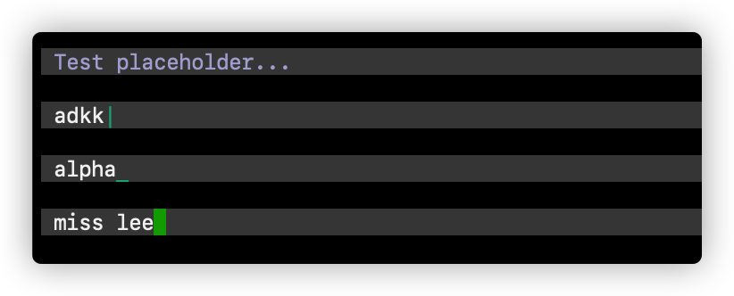
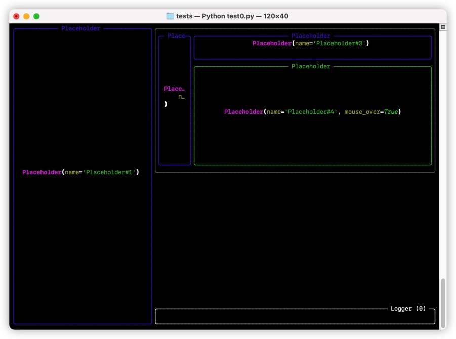

# Textual Learning

Learn [textual](https://github.com/Textualize/textual) in practice.

## Illustrations

**Input widgets** ([issue#132](https://github.com/Textualize/textual/issues/132))

**Create sub-components in View** ([disscussion#62](https://github.com/Textualize/textual/discussions/62))

